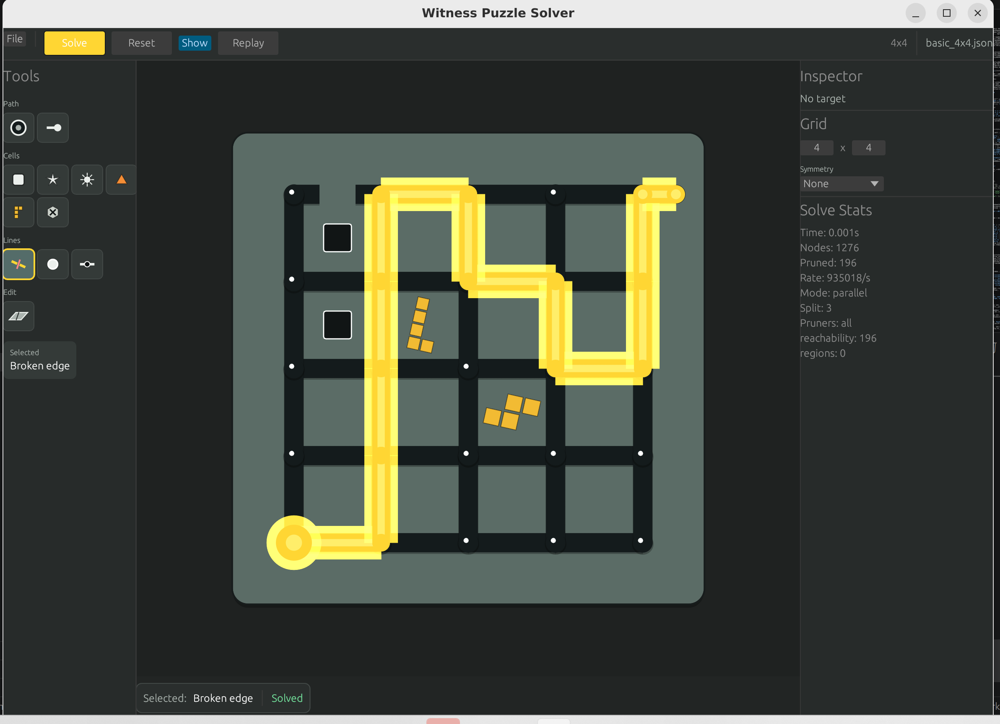
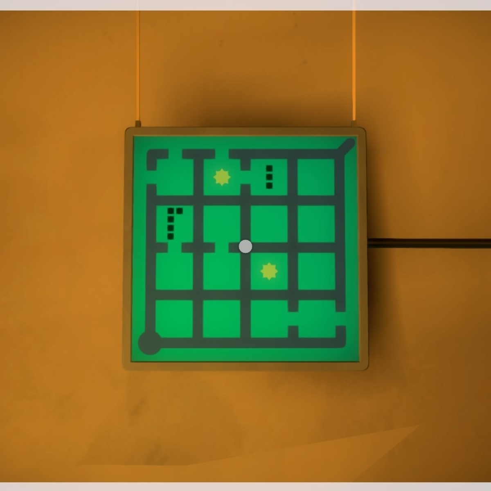

# Witness 风格线谜题求解器与可视化编辑器课程报告

> 课程：Rust 程序设计课程大作业  
> 项目：`witness_solver`  
> 作者：  杨健龙 2300013092  
> 日期：2026-06-29  
> 项目链接: https://github.com/rezeu/witness_solver

## 摘要

本项目实现了一个用 Rust 编写的 Witness-style 线谜题求解器。它模拟
*The Witness* 中“从起点到终点画一条不自交路径，并用路径分割区域来满足符号约束”
这一核心谜题机制，但不是对商业游戏的复刻。项目提供 JSON 谜题格式、命令行求解、
性能分析导出，以及基于 egui 的可视化编辑器和解路径回放。

技术上，项目将求解过程拆成通用 DFS 框架和 Witness 专用建模两层：
`src/solver/` 提供泛型搜索、剪枝接口和回滚栈，`src/witness/` 负责图构建、状态维护、
规则验证、剪枝策略和渲染。核心优化包括原地 `apply/undo` 状态回滚、位集记录边状态、
按 split depth 拆分搜索树后使用 Rayon 并行搜索，以及可组合的 reachability、dots、
triangles、regions、symmetry 剪枝器。实验表明，在 `hard_6x6` 谜题上，并行求解从
11.673 秒降低到 3.952 秒，获得约 2.95 倍加速。

## 1. 项目背景与目标

*The Witness* 的线谜题由规则网格、起点、终点和若干符号组成。玩家需要从起点出发，
沿网格边画出一条不自交路径并到达终点。路径画完后会把棋盘格子切分成若干区域，不同
符号对路径或区域提出约束。例如点要求路径经过指定节点或边，三角形要求对应格子的边界
被路径经过指定次数，方块要求同一区域内的颜色不能冲突，tetris 符号要求区域形状能由给定
多格骨牌拼合。





图 1 展示了本项目 GUI 中的求解结果：灰色网格表示可走边，绿色圆环表示起点，白色圆点表示
节点，黄色高亮线表示求解器找到的路径，紫色区域和符号表示路径分割后的区域约束。

图 2 展示了真实游戏中的截图: 可以看到,本求解器尽可能地还原了游戏中谜题的样式.

本项目的主要目标如下：

- 用 Rust 实现一个性能较高、结构清晰的 Witness-style 谜题求解器。
- 设计可读、可验证的 JSON 谜题格式，便于手写 fixture 和自动测试。
- 提供 CLI，支持顺序 DFS、并行 DFS、剪枝配置和 profile 导出。
- 提供 GUI 编辑器，支持创建和编辑谜题、求解、展示路径和动画回放。
- 通过测试和实验数据说明实现的正确性与优化效果。

## 2. 规则与数据建模

### 2.1 网格建模

项目把谜题建模为一个矩形 cell grid。若谜题有 `width x height` 个格子，则图上有
`(width + 1) * (height + 1)` 个节点。路径沿网格边移动，边分为水平边和垂直边。项目中
`EdgeId` 使用统一编号，并保持一个重要不变量：偶数 edge id 表示水平边，奇数 edge id 表示
垂直边。此设计旨在保持邻近边的序号接近这一特性,便于下标计算.该编号逻辑集中在 `src/witness/indexing.rs`
，便于图构建、状态更新和渲染复用。

以 `4 x 4` 谜题为例：

- cell 坐标范围：`0 <= x < 4`, `0 <= y < 4`
- node 坐标范围：`0 <= x <= 4`, `0 <= y <= 4`
- cell 总数：`4 * 4 = 16`
- node 总数：`(4 + 1) * (4 + 1) = 25`

`WitnessGraph` 在加载时完成输入校验、节点编号、边编号、断边位集、符号位置、邻接表、
终点度数要求和对称映射等预计算。图构建完成后被视为不可变数据，搜索过程只修改
`WitnessState`。

### 2.2 支持的约束

项目支持以下 Witness-style 规则：

| 规则 | 数据位置 | 语义 |
|---|---|---|
| 起点 / 终点 | `starts`, `ends` | 路径必须从唯一起点到唯一终点 |
| 断边 | `broken_edges` | 路径不能经过断开的边 |
| 黑色节点点 / 边点 | `node_dots`, `edge_dots` | 路径必须经过指定节点或边 |
| 彩色节点点 / 边点 | `colored_node_dots`, `colored_edge_dots` | 路径必须经过，且同色点满足区域关系 |
| 方块 | `squares` | 同一区域中的方块颜色不能冲突 |
| 星星 | `stars` | 有星星的颜色在该区域内需要恰好出现两个同色元素 |
| 太阳 | `sun_cells` | 同一区域内同色太阳需要成对出现 |
| 三角 | `triangles` | 对应格子边界被路径经过的数量必须等于三角计数 |
| 正 tetris | `tetris.negative = false` | 区域形状需要能被指定 polyomino 组合覆盖 |
| 负 tetris | `tetris.negative = true` | 可抵消正 tetris 面积或形状要求 |
| 消除符号 | `eliminations` | 可移除同一区域中的一个冲突约束 |
| 镜像对称 | `symmetry = "x" / "y" / "xy"` | 路径移动时同时应用镜像路径 |

这些规则都由 `src/witness/constraints.rs` 中的 `CellConstraint` 和
`src/witness/rules.rs` 中的 `WitnessValidator` 统一处理。非区域规则可以直接在路径层判断，
例如点和三角；方块、星星、太阳、tetris 和消除需要先根据最终路径做区域 flood-fill，再对
每个区域验证。

### 2.3 JSON 输入格式

JSON schema 面向手写和测试，除 `width`、`height`、`starts`、`ends` 外，其余字段均为可选数组。
下面是一个简化示例：

```json
{
  "width": 4,
  "height": 4,
  "starts": [[0, 4]],
  "ends": [[4, 0]],
  "node_dots": [[2, 2]],
  "edge_dots": [[[0, 4], [1, 4]]],
  "broken_edges": [[[1, 1], [1, 2]]],
  "squares": [
    {"pos": [0, 0], "color": 1},
    {"pos": [2, 0], "color": 2}
  ],
  "triangles": [{"pos": [1, 3], "count": 2}],
  "symmetry": "x"
}
```

加载器会拒绝格式错误或语义错误的输入，例如：空尺寸、多个起点、坐标越界、非相邻边、
重复约束、点落在断边上、三角计数非法、tetris 形状不连通或无法放入棋盘等。这样可以保证
后续搜索面对的是一个结构一致的不可变图，而不是在 DFS 热路径中反复处理异常情况。

## 3. 程序设计与 Rust 实现

### 3.1 模块划分

项目采用“通用搜索框架 + Witness 规则实现”的分层结构。

| 模块 | 责任 |
|---|---|
| `src/solver/dfs.rs` | 顺序 DFS、并行 DFS、统计计数 |
| `src/solver/state.rs` | `SearchState` trait，定义状态如何生成和应用移动 |
| `src/solver/pruner.rs` | `Pruner` trait 与 `PrunerChain`，记录每个剪枝器命中次数 |
| `src/solver/satisfier.rs` | `Satisfier` trait，判断当前状态是否已满足目标 |
| `src/solver/undo.rs` | `UndoStack`，支持递归搜索中的状态回滚 |
| `src/witness/schema.rs` | serde 反序列化结构，对应 JSON 格式 |
| `src/witness/graph.rs` | 输入校验、图构建、邻接和约束预计算 |
| `src/witness/state.rs` | Witness 路径状态、移动生成、apply/undo、对称移动 |
| `src/witness/rules.rs` | 完整规则验证 |
| `src/witness/pruners.rs` | 可达性、点、三角、闭合区域、对称剪枝 |
| `src/witness/region.rs` | 根据路径边界 flood-fill 计算区域 |
| `src/main.rs` | clap CLI、profile 导出、GUI 启动 |
| `src/gui.rs` | egui 编辑器、求解统计、路径动画 |

整体数据流如下：

```text
JSON 文件
  -> serde 解析为 PuzzleJson
  -> WitnessGraph::from_json 校验并构建不可变图
  -> WitnessState::new 创建搜索初始状态
  -> DFS 生成移动、apply/undo、调用剪枝器
  -> 到达终点后 WitnessValidator 完整验证
  -> 输出解路径、统计报告或 GUI 动画
```

### 3.2 核心类型设计

| 类型 | 位置 | 设计重点 |
|---|---|---|
| `WitnessGraph` | `src/witness/graph.rs` | 不可变图，保存尺寸、起终点、断边、约束、邻接表和对称映射 |
| `WitnessState` | `src/witness/state.rs` | 可变搜索状态，保存已用边 bitset、节点度数和当前 head |
| `WitnessValidator` | `src/witness/rules.rs` | 终局规则验证器，实现 `Satisfier<WitnessState>` |
| `PrunerChain` | `src/solver/pruner.rs` | 组合多个剪枝器，并记录 per-pruner hit counts |
| `SolverConfig` | `src/witness/mod.rs` | 控制并行、split depth、auto split 和剪枝 profile |
| `SolverReport` | `src/witness/mod.rs` | 输出 solved、耗时、节点数、剪枝数、work items 和剪枝命中 |
| `ProfileReport` | `src/witness/mod.rs` | profile 模式下的顺序与多组并行 benchmark 结果 |

这里没有把每条规则写成独立的外部 API，而是把它们封装在 `WitnessGraph` 预处理、
`WitnessState` 搜索状态和 `WitnessValidator` 终局判断中。这样 CLI、GUI 和测试都可以使用同一套
库级入口：

- `load_puzzle(path)`
- `solve_puzzle(graph, config)`
- `profile_puzzle(graph, config)`

### 3.3 Rust 设计点

**trait 抽象。** 通用 DFS 只依赖 `SearchState`、`Pruner` 和 `Satisfier`，不知道 Witness 的具体规则。
这使搜索框架保持独立，也方便后续复用到其他图搜索问题。

**不可变图 + 可变状态。** `WitnessGraph` 在加载时完成校验和预计算，搜索过程中通过共享引用读取。
`WitnessState` 则是 DFS 递归中频繁变化的状态，只保存热路径需要的数据：已用边、节点度数和当前位置。

**原地 apply/undo。** DFS 每走一步会修改 `WitnessState`，并把反向操作压入 `UndoStack`。递归返回时
通过 rollback 恢复状态。相比每层 clone 整个状态，这种方式能减少内存分配和复制，更适合搜索树深、
分支多的谜题。

**serde 数据建模。** `PuzzleJson` 与 JSON 字段一一对应，使用 `serde` 负责输入解析，`WitnessGraph`
负责语义校验。解析和校验分开后，错误信息更集中，也避免把 JSON 细节泄漏到算法层。

**Rayon 并行。** 并行 DFS 先按 `split_depth` 展开搜索树前几层，得到多个独立 work items，然后使用
Rayon 的 work-stealing 并行求解各子树。找到任意解后用原子标志通知其他 worker 尽快停止。

## 4. 算法与优化

### 4.1 DFS 搜索流程

求解流程可以概括为：

```text
state = 起点状态
dfs(state):
  如果当前状态可被剪枝，返回无解
  如果当前状态满足完整规则，返回解
  生成从 head 出发的所有候选边
  按启发式顺序排序候选边
  对每条候选边:
    apply_move
    递归 dfs
    rollback
```

移动生成阶段会过滤掉以下非法移动：

- 边已经被使用。
- 边是断边。
- 目标节点已经在路径中且不是允许作为终点的节点。
- 对称谜题中，镜像边已经被使用、断开，或镜像目标节点非法。

当路径到达终点后，`WitnessValidator` 会检查起终点度数、普通节点度数、所有点是否经过、
三角计数是否准确，并在需要时计算区域以验证方块、星星、太阳、tetris、消除和彩色点规则。

### 4.2 移动排序

`WitnessState::gen_moves` 生成候选移动后会进行确定性排序。排序优先考虑：

- 会经过点约束的边或节点。
- 更接近终点的目标节点。
- 边编号本身，保证结果可复现。

这不是强剪枝，但能让求解更稳定，也让测试和 profile 结果更容易比较。

### 4.3 剪枝策略

项目支持通过 `--pruners` 或 `SolverConfig.pruner_profile` 选择剪枝 profile：

| Profile | 含义 |
|---|---|
| `none` | 不使用剪枝，用于正确性对照 |
| `reachability` | head 已无法到达终点时剪枝 |
| `dots` | 终点和未访问点都必须仍然可达 |
| `triangles` | 三角边数已经超过或不可能达到目标时剪枝 |
| `regions` | 对已经闭合的区域提前验证颜色类规则 |
| `symmetry` | 对镜像路径做可达性和点约束剪枝 |
| `all` | 默认生产配置，组合全部适用剪枝 |

可达性剪枝使用一次小规模 BFS，避开已用边、断边和不允许再次经过的节点。如果终点不再可达，
当前搜索分支必然失败。

点剪枝在可达性基础上增加必须经过的点：未访问的点节点必须仍可达，未使用的点边至少有一个
端点仍可达。

三角剪枝对每个三角格子统计已使用边数和仍可用边数。如果已使用边数超过目标，或即使用上所有
剩余可用边也达不到目标，就可以立即剪枝。

闭合区域剪枝用于方块、星星和太阳等区域规则。当某个区域内部再也不能被未来路径切分时，可以
提前验证该区域，避免等到终点才发现颜色冲突。

对称剪枝在带镜像规则的谜题中同时考虑玩家 head 和镜像 head 的可达性。如果镜像路径使某些终点
或点不可能完成，也可以提前剪掉该分支。

### 4.4 并行 DFS

直接把递归 DFS 并行化会造成任务太细和同步开销过大。本项目采用两阶段策略：

1. 主线程先展开搜索树前 `split_depth` 层。
2. 每个展开后的状态作为独立 work item。
3. 使用 `into_par_iter().find_map_any(...)` 并行搜索这些子树。
4. 任一 worker 找到解后设置 `found` 原子标志，其他 worker 尽快退出。

`split_depth` 是并行效率的关键参数。太小会导致 work items 不够，CPU 利用率不足；太大又会在拆分
阶段产生额外 clone 和调度开销。CLI 提供 `--split-depth` 手动配置，也提供 `--auto-split` 根据 CPU
数量和早期分支数自动估计。

### 4.5 性能实验

实验数据来自 `docs/experiments/results.md`，生成命令为：

```bash
cargo run --release -- <puzzle> --profile --pruners all
```

测试环境为 8 逻辑 CPU 的 WSL 环境。

| Puzzle | Sequential | Best Parallel | Split | Speedup | Seq Nodes | Best Par Nodes | Best Par Pruned | Work Items | Dominant Pruner Hits |
|---|---:|---:|---:|---:|---:|---:|---:|---:|---|
| `basic_4x4` | 0.000012s | 0.000280s | 3 | 0.04x | 9 | 13 | 0 | 10 | reachability: 0 |
| `dots_3x3` | 0.000014s | 0.000246s | 3 | 0.06x | 12 | 16 | 0 | 10 | dots: 0 |
| `hard_6x6` | 11.673s | 3.952s | 4 | 2.95x | 12,855,257 | 20,308,959 | 9,989,519 | 24 | dots: 6,138,381; triangles: 300,446; regions: 3,550,692 |

从结果可以看出，小谜题上并行求解明显更慢，因为求解本身只需要十几个节点，Rayon 初始化、
任务拆分和同步开销远大于搜索开销。`hard_6x6` 才是有代表性的测试：顺序 DFS 需要 11.673 秒，
最佳并行配置为 split depth 4，用时 3.952 秒，约 2.95 倍加速。该谜题中剪枝器共拒绝约
998 万个状态，其中 dots 和 regions 命中最多，说明约束相关剪枝对复杂谜题非常关键。

## 5. GUI 与可视化

GUI 使用 egui/eframe 实现，入口在 `src/gui.rs`。命令如下：

```bash
cargo run --release -- --gui
```

不带任何参数直接运行 `cargo run --release` 时，也会默认打开 GUI。这比默认打开 CLI 更适合课程展示，
因为老师可以直接看到编辑器、棋盘和求解效果。

GUI 的主要功能包括：

- 创建和编辑矩形网格谜题。
- 放置起点、终点、断边、点、方块、星星、太阳、三角、tetris、消除和对称约束。
- 从 GUI 调用同一套 `solve_puzzle` 库级 API。
- 显示是否求解成功、耗时、访问节点数、剪枝数和 split depth。
- 在棋盘上高亮解路径，并支持回放动画。
- 在 `EditablePuzzle` 与 `PuzzleJson` 之间集中转换，避免 GUI 状态和文件格式分散维护。

图 1 已展示“求解成功后的黄色路径”。正式报告建议再补两张项目截图：

- 空白编辑器：展示工具栏、棋盘和右侧 inspector。
- 放置多种约束后的谜题：展示符号编辑能力。

这些截图应来自本项目 GUI，而不是原游戏素材。可以在运行 GUI 后使用系统截图工具截取，并放入
`docs/screenshots/`，再在本报告中插入图片链接。

## 6. CLI、Profile 与输出

CLI 使用 clap derive 定义参数，入口在 `src/main.rs`。常用命令如下：

```bash
cargo run --release -- puzzles/basic_4x4.json
cargo run --release -- puzzles/basic_4x4.json --seq
cargo run --release -- puzzles/basic_4x4.json --auto-split --pruners all
cargo run --release -- puzzles/hard_6x6.json --profile \
  --profile-json /tmp/profile.json \
  --profile-csv /tmp/profile.csv
```

普通求解模式会打印棋盘、是否求解成功、访问节点数、剪枝数、耗时、split depth 和剪枝 profile。
Profile 模式会先跑顺序 DFS，再分别测试多个并行 split depth，并输出最佳配置。JSON 和 CSV 导出
包含以下信息：

- mode：顺序或并行。
- split depth。
- elapsed seconds。
- explored nodes。
- pruned states。
- per-pruner hit counts。
- work items。
- solved。
- pruner profile。

这些字段既用于命令行观察，也可以直接导入表格软件或脚本生成课程报告中的图表。

## 7. 测试与正确性验证

本项目的测试策略分为四类。

| 测试文件 | 覆盖内容 |
|---|---|
| `tests/api.rs` | 公共 API、配置项、报告字段、剪枝 profile |
| `tests/puzzles.rs` | 所有 puzzle fixture 的可解 / 不可解回归测试，并比较顺序与并行结果 |
| `tests/proptest.rs` | `apply_move` / `rollback` 回滚一致性、移动生成属性测试 |
| `tests/validation.rs` | 输入校验，覆盖非法尺寸、越界、重复约束、非法边、非法 tetris 等 |

推荐验证命令：

```bash
cargo check
cargo clippy --all-targets -- -D warnings
cargo test --release
```

Release 测试是项目基准，因为 DFS-heavy 测试在 debug build 下会显著变慢。对于压力测试，可以单独运行：

```bash
cargo test --release -- --ignored
```

其中 `stress_7x7` 被标记为 ignored，避免普通测试意外耗时过长。对于 CLI/profile 改动，建议至少运行：

```bash
cargo run --release -- puzzles/minimal_1x1.json --seq
cargo run --release -- puzzles/minimal_1x1.json --auto-split --pruners all
cargo run --release -- puzzles/minimal_1x1.json --profile \
  --profile-json /tmp/witness_profile.json \
  --profile-csv /tmp/witness_profile.csv \
  --pruners all
```

## 8. 项目收获

这个项目的主要收获不在于把规则简单硬编码出来，而在于把搜索问题拆成可维护的 Rust 工程结构。

首先，所有权和借用规则迫使状态设计更明确。不可变 `WitnessGraph` 与可变 `WitnessState` 的分离，
让共享上下文和递归状态不会混在一起。`UndoStack` 记录反向操作，既符合 DFS 的回溯模型，也减少
了 clone-heavy 实现带来的额外开销。

其次，trait 泛型让 DFS 框架和具体谜题规则解耦。`SearchState` 只关心如何生成和应用移动，
`Pruner` 只关心当前状态能否提前放弃，`Satisfier` 只关心状态是否已经满足目标。Witness 规则只是
这些接口的一种实现。

第三，Rayon 并行展示了 Rust 在数据竞争安全方面的优势。并行 worker 持有各自的状态副本，共享
不可变图和剪枝器引用，统计信息通过原子计数维护。并行化过程中最需要权衡的是任务粒度，而不是
手写线程管理。

最后，serde 和 egui 让算法项目具备了完整使用体验：JSON fixture 便于测试和复现实验，GUI 则便于
展示规则、编辑谜题和观察求解路径。这比只提交一个命令行算法程序更适合课程答辩。

## 9. 不足与展望

当前项目仍然是 Witness-style 谜题求解器，而不是完整商业游戏复刻。规则覆盖已经较多，但真实游戏
还有更多关卡特例、视觉表达和交互细节。GUI 目前可用于编辑和展示，但与专业关卡编辑器相比，批量
操作、撤销重做、图层管理和导入导出体验仍有提升空间。

算法方面，DFS 的最坏情况仍然指数爆炸。虽然可达性、点、三角和闭合区域剪枝已经能处理一批中等
规模谜题，但更复杂的 tetris、消除和对称组合仍可能很慢。后续可以考虑：

- 更强的区域约束前向检查。
- 针对 tetris 的缓存和精确覆盖优化。
- 更系统的剪枝 ablation benchmark。
- 使用启发式搜索或 SAT/Exact Cover 编码处理特定规则组合。
- 增加更多真实关卡风格的 fixture，并完善 GUI 截图与演示数据。

## 10. 结论

`witness_solver` 从规则建模、搜索框架、剪枝优化、并行求解、profile 导出到 GUI 展示形成了一个
较完整的 Rust 课程项目。它既体现了 Rust 在类型安全、所有权、泛型抽象和并行编程上的特点，也
通过实际实验说明：对于小谜题，并行开销可能大于收益；对于复杂谜题，合理剪枝和任务拆分能显著
降低求解时间。整体上，本项目达到了“可运行、可测试、可分析、可展示”的课程大作业目标。

## 附录 A：参考文件

- 项目入口与 CLI：`src/main.rs`
- GUI：`src/gui.rs`
- 通用 DFS：`src/solver/dfs.rs`
- 搜索状态 trait：`src/solver/state.rs`
- Undo 栈：`src/solver/undo.rs`
- JSON schema：`src/witness/schema.rs`
- 图构建与校验：`src/witness/graph.rs`
- Witness 状态：`src/witness/state.rs`
- 规则验证：`src/witness/rules.rs`
- 剪枝器：`src/witness/pruners.rs`
- 区域计算：`src/witness/region.rs`
- JSON 格式说明：`docs/puzzle-format.md`
- 算法说明：`docs/algorithm.md`
- 实验结果：`docs/experiments/results.md`
- GUI 截图：`docs/screenshots/solver-demo.png`

